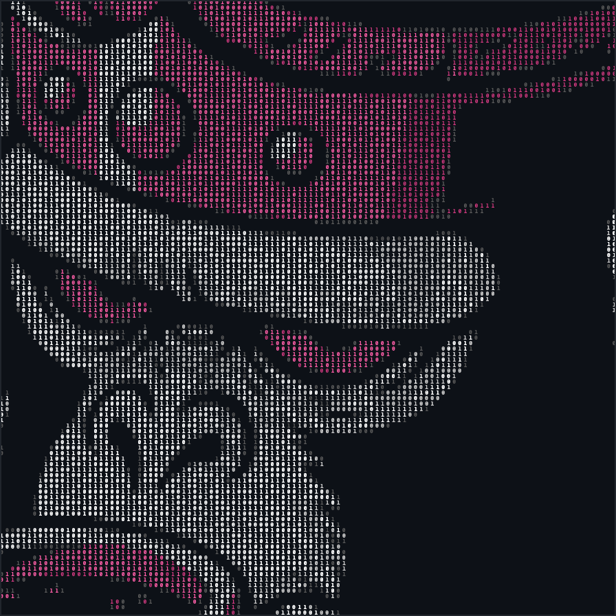

<table>
<tr>
<td width="60%">


</td>
<td width="40%">


</td>
</tr>
</table>

## 🧑‍💻 Sobre mim

<table>
<tr>
<td width="60%" valign="top">

```typescript
const natan = {
  papel: "Lead Product Engineer @ Instituto Índigo",
  local: "São Paulo, BR 🇧🇷",

  construindo: [
    "ERP clínico web — React + TS + Tailwind",
    "App mobile nas lojas — RN + Expo + EAS",
    "Evolução para SaaS multitenant",
  ],

  história: {
    2023: "Analista de Produto",
    2025: "Front-end em agência",
    hoje: "Lead de produto e front",
  },

  exit: "Otto — IA pra WhatsApp: vendido 🤝",
  diferencial: "Superior em Design Gráfico",
};
```

> *"Me traz um problema difícil. Eu devolvo sistema funcionando."*

</td>
<td width="40%" valign="top">



</td>
</tr>
</table>

## 🔗 Contato

<div align="center">

[](https://linkedin.com/in/natan-oliveira-ti)
[](mailto:natantatan2000@gmail.com)

</div>

## 📦 Produtos no ar

| Projeto | O que é | Stack |
|---|---|---|
| 🏥 **Índigo Gestão** | ERP + app mobile para clínicas de terapia (lidero produto e front) | React, TS, RN/Expo |
| 🤖 **[Otto](https://otto.73code.com)** | Atendente de IA pra WhatsApp — clientes, MRR e exit | IA, webhooks, AWS |
| 📋 **[Escopo Fácil](https://escopofacil.com.br)** | Gestor de projetos kanban | PHP, JS |
| 📣 **[CG Marketing](https://cgmarketingsolutions.com.br)** | Site institucional para agência de tráfego | JS |

## 📊 Constância

<div align="center">


</div>
