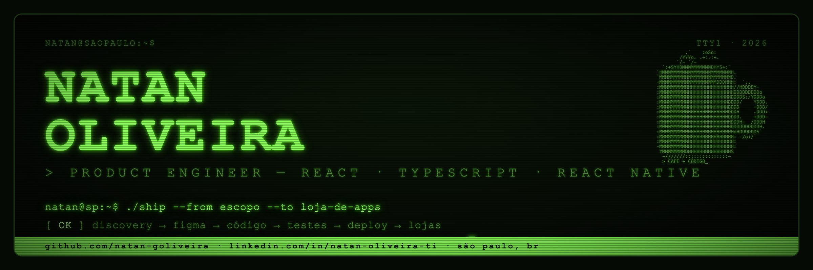

<div align="center">




# Natan Oliveira

**Product Engineer · Front-end — React · TypeScript · React Native**

*Levo produto do escopo à loja de apps.*

</div>

## 🧑‍💻 Sobre mim

```typescript
const natan = {
  papel: "Lead Product Engineer @ Instituto Índigo",
  local: "São Paulo, BR 🇧🇷",

  construindo: [
    "ERP clínico web (React + TypeScript + Tailwind)",
    "App mobile nas lojas (React Native + Expo + EAS)",
    "Evolução para SaaS multitenant",
  ],

  história: {
    2023: "Analista de Produto — discovery, escopo, priorização",
    2025: "Front-end em agência — React, PHP/Laravel, e-commerce",
    hoje: "Lead de produto e front — do Figma ao deploy",
  },

  exit: "Otto — atendente de IA pra WhatsApp: clientes, MRR e venda 🤝",

  diferencial: "Superior em Design Gráfico — front-end que nasce com design",
};
```

> *"Me traz um problema difícil. Eu devolvo sistema funcionando."*

## 🛠️ Stack

**Front-end**


**Back-end & Dados**


**Qualidade & Infra**


**Produto & Design**


## 📦 Produtos no ar

| Projeto | O que é | Stack |
|---|---|---|
| 🏥 **Índigo Gestão** | ERP + app mobile para clínicas de terapia (lidero produto e front) | React, TS, RN/Expo |
| 🤖 **[Otto](https://otto.73code.com)** | Atendente de IA pra WhatsApp — clientes, MRR e exit | IA, webhooks, AWS |
| 📋 **[Escopo Fácil](https://escopofacil.com.br)** | Gestor de projetos kanban | PHP, JS |
| 📣 **[CG Marketing](https://cgmarketingsolutions.com.br)** | Site institucional para agência de tráfego | JS |

## 📊 Analytics

<div align="center">


</div>

## 📫 Contato

[](https://linkedin.com/in/natan-oliveira-ti)
[](mailto:natantatan2000@gmail.com)
